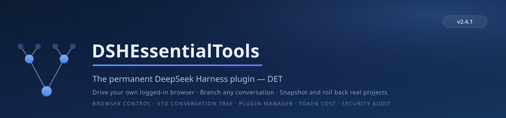

<p align="center">
  
</p>

<p align="center">
  <b>A permanent DeepSeek Harness (DSH) plugin</b><br>
  Project run &amp; code viewer · Program snapshots · VTD conversation tree (edit / retry / branches) · Message micro-versioning · DET manager · Global plugin control
</p>

<p align="center">
  <a href="LICENSE"></a>
  
  
  
</p>

---

**DSH（DeepSeek Harness）永久插件** —— 面向 C/C++ 桌面工程（Visual Studio / MSBuild）的一站式开发助手工具栏 + **VTD 虚拟对话树与版本管理**。**与原生 DSH 风格高度一体、界面简洁**；随 DSH 常驻、重启不丢，自动出现在 Settings → Plugin inventory。

> v2 起为**永久插件**（npm 包）；v1（动态插件，`plugin/` 目录）保留作开发/快速装载用途。

## 🎉 v2.2.0 更新亮点

- **更贴合原生 DSH 风格**：全局插件管理面板、VTD 对话页签、右侧工具栏均对齐 DSH 原生的观感与交互——同样的层级、同样的色彩变量、同样的滑动/折叠/卡片语言，几乎看不出是外挂。
- **更简洁的界面**：面板去重、操作收拢到一处；常驻插件用「启用/禁用」二分开关替代繁琐五档；扫描 / 纳入 / 刷新均在当前标签内一键完成，避免到处跳转。
- **全局插件管理强化**：
  - 修复了全局插件库读取崩溃（存储域 `dsh_global_plugins` 读表改为 `entries()`）与并发首开竞态；
  - **扫描已安装插件**：列出随 DSH 常驻的永久宿主插件（自动排除 DET 本身），可一键纳入全局插件库；
  - **常驻插件二分开关**：对 DBS 这类跨会话插件做「启用/禁用」，实时经 Loader 卸载/装载、跨重启持久化，切换后自动刷新前端；
  - **两种 GitHub 安装方式**：① 直接下载（`det_global_plugin_github_direct`）；② AI 读取源码自行编写（`det_global_plugin_github_rebuild` → `det_global_plugin_github_save`），注入「病毒/漏洞检查上下文」，**不直接执行第三方代码**。

## ✨ Features

### 🖥 右侧工具栏
| 图标 | 名称 | 功能 |
| --- | --- | --- |
| ▶ | 运行 | 自动识别工作区可运行入口（`main/entry/run` 的 py / cpp，或 `.sln/.slnx`），MSBuild 编译并启动程序 |
| 🗎 | 文件 | 浏览当前会话工作区文件（文件夹折叠树），点击预览 |
| 🕘 | 版本 | 程序大版本：手动快照 / 回退（回退前自动备份）/ 删除，**只动代码文件** |

### 🌲 VTD 虚拟对话树
- **编辑 / 重试**用户消息 → 创建真实分支子会话（`origin: vtd-fork`，侧边栏隐藏）让模型重答，原对话保留
- **`<N>` 分叉选择器**：分支间切换，自动**快照当前工作区并按目标分支恢复代码**（消息小版本机制）
- **VTD 对话标签**：分支感知消息流 + 精细 Markdown、推理折叠、工具调用/结果卡片
- **消息小版本**：`baseline` / `edit` / `retry` / `auto-switch` 自动记录，可回退

### 🛠 DET 管理器（Settings 页面）
- 四个功能开关（文件 / 运行 / 版本 / VTD）：即时装载/卸载 UI，持久化于 `~/.dsh/storages/dsh_versions.json`
- **会话侧边栏登记簿**：只存“存在的对话”元数据，**不存对话本体**；`session/created` 即时登记 + 60s 节流自检 + 手动“自检并修复”
- **VTD 调试**：查看被隐藏的真实对话（根会话 + 全部 fork 子会话）与自动版本控制记录

### 🌐 全局插件控制（Settings 独立条目「全局插件管理」）
- **全局插件库**：进程级、跨重启持久化插件清单（存储域 `dsh_global_plugins`），每个插件有名称、描述、来源与**五个档位**：
  1. `always` 全局启用 —— 每个会话自动挂载（会话打开即生效）
  2. `ai-auto` 对话AI可自行决定启用 —— 对话内 AI 可自行启用（自动批准，无需用户）
  3. `ai-approve` 对话内AI需审批启用 —— AI 请求走动态 Cordis 审批，用户批准后生效（默认档位）
  4. `frozen` 不再会有新启用 —— 拒绝一切新启用（含用户手动）；已启用会话保持运行
  5. `disabled` 全局禁用 —— 立即停止所有会话实例并拒绝任何启用
- **来源一·从对话拉取**：列出所有运行中会话的动态 Cordis 插件（跨会话选择），一键晋升为全局插件（拷贝 host/client 代码与名称/描述）
- **来源二·应用商店 / URL 下载**：
  - GitHub 搜索 DSH 插件 → 结果窗口展示（名称/描述/星数）→ **AI 摘要**（宿主 LLM 生成特性总结，**本地存档缓存，不重复消耗 token**）→ 安装
  - 或直接粘贴 JSON 清单 URL 下载：`{ name, description, host?, client?, hostUrl?, clientUrl? }`；GitHub 仓库约定：根 `dsh-plugin.json` 或 `plugin/host.js` + `plugin/client.js`
- **两种从 GitHub 下载/获取插件的方式**：
  1. **直接下载**（`det_global_plugin_github_direct`）：传入仓库 URL / `owner/repo` / 插件文件 URL，按约定格式拉取代码并入库，返回可疑代码扫描警告；
  2. **AI 读取源码自行编写**（`det_global_plugin_github_rebuild` → `det_global_plugin_github_save`）：拉取仓库 README 与 host/client 源码，注入「病毒/漏洞检查上下文」供 AI 审查，AI 对照源码自行实现等价（更安全）版本再入库——**不直接执行第三方代码**。
- **对话内 AI 工具**：`det_global_plugin_list` / `det_global_plugin_enable` / `det_global_plugin_disable`（档位在宿主强制执行）
- **扫描已安装插件**：列出当前 DSH 已常驻装载的「永久宿主插件」（如 DBS 背景音乐），自动排除 DET 全局插件库管理器本身；`det_global_plugin_scan_installed`（对话内）与设置页「全局插件管理 → 已安装插件」均可扫描查看装载状态；点击「纳入全局插件库」（`det_global_plugin_import_installed` / `gpImportInstalled`）即成为常驻型全局插件
- **常驻插件二分开关（启用/禁用）**：对 DBS 这类跨会话常驻插件，用「启用/禁用」代替五档（`det_global_plugin_set_enabled` / `gpSetPermanentEnabled` / 设置页卡片开关）——禁用时经 `loader.update` 实时卸载宿主实例，启用时重新加载；`globallyEnabled` 持久化，重启后再次应用；切换后**自动刷新前端**让该插件 UI 随之消失/重现
- ⚠ 安全口径：全局插件代码与动态 Cordis 插件一致，以当前进程真实权限运行；安装/下载前有明确提示

### 💰 DeepSeek 余额 · 模型单价
- **右下角余额悬浮卡**：官方接口 `GET https://api.deepseek.com/user/balance`（Bearer key → `balance_infos`：币种/总计/赠送/充值），60s 自动刷新 + 手动刷新；点击展开明细（多币种 `¥/ $` 分列、账户可用性、错误提示如 Key 无效/欠费）。
- **耗尽时间估算**：从会话日志读取 provider 用量（`assistant/message` 的 `data.usage`，与 token-meter 同源采样），**近 7 天优先、近 30 天兜底**，按「当前默认模型(deepseek-official) × 错峰单价」折算日均费用，给出**预计耗尽天数**（与价格同币种的余额桶匹配才估算；估算假设在 UI 中注明）。
- **模型选择旁边的单价芯片**：从 DeepSeek **官网定价页（中文页优先，CNY 计价：输入命中/未命中 × 错峰/峰值 + 输出；英文页 USD 兜底）** 解析每模型单价（每 1M tokens），按当前 **峰值/错峰时段**动态显示（峰值 = 北京时间周一至周五 9:00-12:00/14:00-18:00，与 UTC 01:00-04:00/06:00-10:00 同一时刻）；悬停显示完整价格表与更新来源；6 小时缓存、解析失败回退上次成功值。
- **API key 来源（宿主解析，绝不落盘/日志/回传）**：DET 配置 `dsApiKey` → DSH 凭据缝（`llm-deepseek` 记录 → `DEEPSEEK_API_KEY` 引用）→ 启动环境变量；与模型设置共用一把 key。
- **参考实现与安全剔除**：借鉴了 [micc99/deepseek-balance-monitor](https://github.com/micc99/deepseek-balance-monitor)（余额接口/响应解析/零余额跳过显示）与 [tunggian/DeepSeekBalanceMonitor](https://github.com/tunggian/DeepSeekBalanceMonitor)（Bearer 请求与 401/429/瞬时错误处理）等公开项目做法；**明确未采用**：usage-proxy 本地 MITM 代理、sqlite 用量台账（key 哈希统计）、明文 key 配置文件、任何遥测/统计/上报。网络仅访问 `api.deepseek.com` 与 `api-docs.deepseek.com`。

### 📋 消息分类
真实用户输入（`source.kind === 'user'`）才作为用户气泡；系统代提（上下文注入 / 审批提示 / 技能目录等）与空消息渲染为折叠的“上下文注入”行；工具结果按卡片渲染——不会混在用户气泡里。

## 🚀 Quick start

1. 安装包：

   ```powershell
   dsh plugin --profile web add dsh-essential-tools
   ```

2. 在 `%USERPROFILE%\.dsh\profiles\web\cordis.patch.yml` 追加注册行：

   ```yaml
   - id: dsh-essential-tools
     name: 'dsh-essential-tools'
     config:
       lvalRoot: 'C:\path\to\your\project'
       srcDir: 'C:\path\to\your\project\src'
       solution: 'C:\path\to\your\project\YourApp.slnx'
       msbuild: 'C:\Program Files\Microsoft Visual Studio\18\Community\MSBuild\Current\Bin\MSBuild.exe'
       configuration: 'Debug'
       platform: 'x64'
   ```

3. 重启 DSH → 插件常驻（永久），Settings → Plugin inventory 可见。

> v1 动态装载（仅开发用）：`cordis_define` 创建并粘贴 `plugin/host.js` / `plugin/client.js`，`cordis_run` 激活。

## 🧩 Capabilities & compatibility

<details>
<summary>端点清单（dshEssentialTools/*）与技术细节</summary>

**Host 半区**（`lib/index.js`）：`TypertRemoteService` 子类 + `ctx.typert.register`（src-json codec）；依赖服务经 `ctx.get` 读取，缺失安全降级。
**VTD 存储域**（`lib/vtd/index.js`）：`dsh_versions` 域（version 2，无迁移）：`minor_versions` / `sessions`（登记簿）/ `settings`（开关与自检报告）。
**Client 半区**（`lib/client.js`）：`window.__ModuleLoader__.load` bundle，插槽 `shell.overlay` / `conversation.view` / `conversation.chat.user-actions` / `settings.section`。

端点：`lvalInfo` `lvalListFiles` `lvalReadFile` `lvalRun` `workspaceDetectEndpoint` `verProgCreate` `verProgList` `verProgRestore` `verProgDelete` `treeView` `editMessage` `retryMessage` `switchFork` `newMessage` `debugSessions` `debugMinor` `registryList` `registrySelfCheck` `detFeatureGet` `detFeatureSet` **`gpList` `gpCordisInventory` `gpPull` `gpDownload` `gpStoreSearch` `gpStoreInspect` `gpStoreSummarize` `gpInstall` `gpGithubDirect` `gpGithubRebuild` `gpGithubSave` `gpScanInstalled` `gpImportInstalled` `gpSetPermanentEnabled` `gpSetLevel` `gpSetMeta` `gpDelete` `gpSessionEnable` `gpSessionDisable` `gpCheckApproval` `gpCode` `dsBalance` `dsPrice`**

模型工具（对话内 AI）：**`det_global_plugin_list` `det_global_plugin_enable` `det_global_plugin_disable` `det_global_plugin_scan_installed` `det_global_plugin_import_installed` `det_global_plugin_set_enabled` `det_global_plugin_github_direct` `det_global_plugin_github_rebuild` `det_global_plugin_github_save`**

</details>

> ⚠️ 需要 DSH 0.1.1-rc.2+；`session.list` 的浏览器端 schema 需接受 `origin: 'vtd-fork'`（会话层 `dsh-session` 已支持；API/UI 层若缺失会导致会话列表解析失败——确认上游修复或按 `ARCHITECTURE.md` 说明打本地补丁）。

## 🔒 安全
安全设计、五维审查结论（插件越权/恶意代码/易错点/外部攻击面/开源泄露）与已落实修复清单见 [`docs/SECURITY.md`](docs/SECURITY.md)。要点：插件代码 = 当前进程真实权限（非安全边界，请只启用信任的代码）；下载/安装全链路 SSRF 防护 + 可疑代码扫描 + commit 溯源；API key 仅宿主解析、绝不落盘/回传。

## License
[MIT](LICENSE) © 2026 L2959159224
